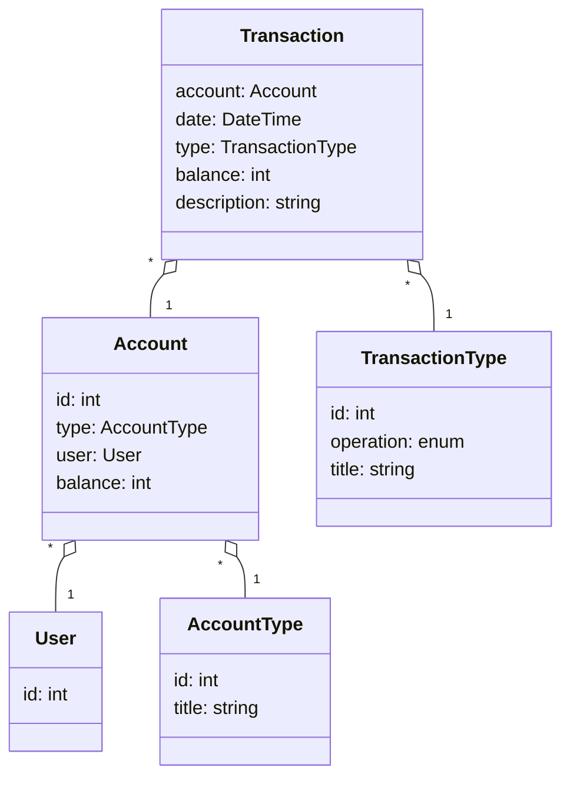

```mermaid
classDiagram

    class User {
        id: int
    }

    class AccountType {
        id: int
        title: string
    }

    class Account {
        id: int
        type: AccountType
        user: User
        balance: int
    }

%% 0 - set; -1 - remove, +1 - add
    class TransactionType {
        id: int
        operation: enum
        title: string
    }

    class Transaction {
        account: Account
        date: DateTime
        type: TransactionType
        balance: int
        description: string
    }

    Account "*" o-- "1" User
    Account "*" o-- "1" AccountType
    Transaction "*" o-- "1" Account
    Transaction "*" o-- "1" TransactionType
```
